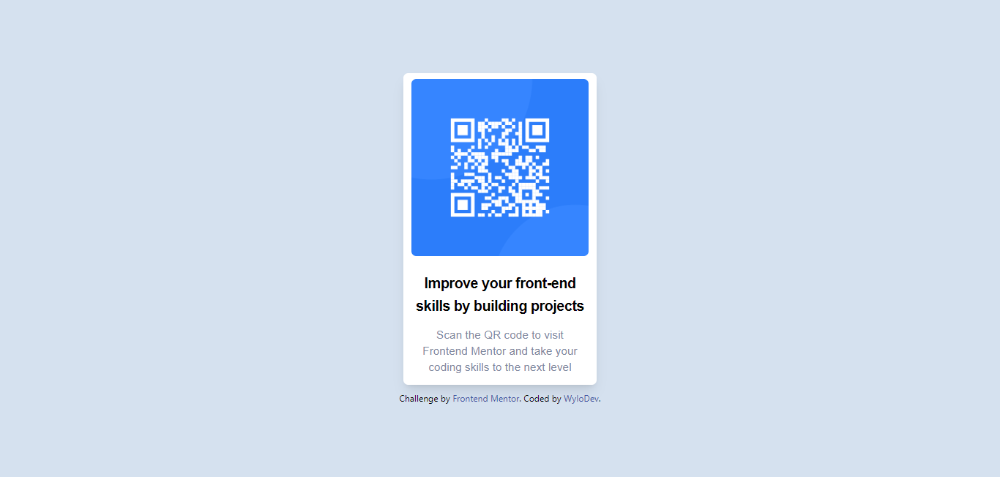

# Frontend Mentor - QR code component solution

This is a solution to the [QR code component challenge on Frontend Mentor](https://www.frontendmentor.io/challenges/qr-code-component-iux_sIO_H). Frontend Mentor challenges help you improve your coding skills by building realistic projects. 

## Table of contents

- [Overview](#overview)
  - [Screenshot](#screenshot)
  - [Links](#links)
- [My process](#my-process)
  - [Built with](#built-with)
  - [Useful resources](#useful-resources)
- [Author](#author)

## Overview

### Screenshot

### Links

- Live Site URL: [QR Code Component](https://jocular-kitten-b7842f.netlify.app/)

## My process

### Built with

- HTML
- [TailwindCSS](https://tailwindcss.com/) - utility-first CSS framework 

## Author

- Frontend Mentor - [@wylogee](https://www.frontendmentor.io/profile/Wylogee)

